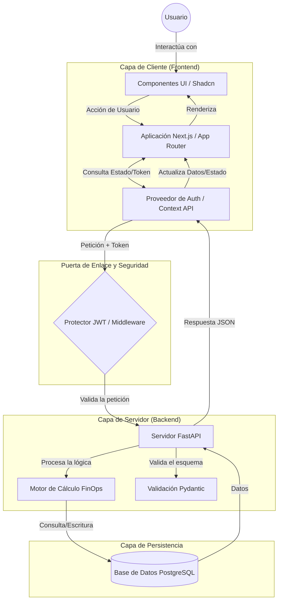

# 🏗️ Arquitectura del Sistema: Optima

Este documento describe la arquitectura del sistema Optima, desde la visión general hasta los detalles técnicos de cada capa.

## 📋 Tabla de Contenidos
1. [Visión General y Propósito](#1-visión-general-y-propósito)
2. [Diseño de Alto Nivel (High-Level Design)](#2-diseño-de-alto-nivel-high-level-design)
   - [2.1 Diagrama de Flujo de Datos](#21-diagrama-de-flujo-de-datos)
   - [2.2 Capas Arquitectónicas del Sistema](#22-capas-arquitectónicas-del-sistema)
3. [Estructura de Directorios](#3-estructura-de-directorios)
4. [Arquitectura de Frontend](#4-arquitectura-de-frontend)
   - [4.1 Design System & UI Strategy](#41-design-system--ui-strategy)
   - [4.2 Gestión de Estado (State Management)](#42-gestión-de-estado-state-management)
   - [4.3 Resiliencia y Manejo de Errores](#43-resiliencia-y-manejo-de-errores)
5. [Arquitectura de Backend](#5-arquitectura-de-backend)
   - [5.1 Stack Tecnológico](#51-stack-tecnológico)
   - [5.2 Motor FinOps (Domain Logic)](#52-motor-finops-domain-logic)
   - [5.3 Seguridad](#53-seguridad)
6. [Capa de Datos y Persistencia](#6-capa-de-datos-y-persistencia)
7. [Infraestructura y DevOps](#7-infraestructura-y-devops)
8. [Registros de Decisiones Arquitectónicas (ADR)](#8-registros-de-decisiones-arquitectónicas-adr)
9. [Tech Stack (Resumen)](#9-tech-stack-resumen)

## 1. Visión General y Propósito

**Optima** es una plataforma de **FinOps** (Financial Operations) diseñada para la gestión inteligente, optimización y auditoría de licencias de software y costos en la nube.

El sistema sigue un patrón de **Arquitectura Desacoplada** (Client-Server) y una filosofía de **Design-Driven Development**. El objetivo técnico es separar estrictamente la lógica de cálculo financiero (Backend) de la capa de presentación visual (Frontend), permitiendo escalabilidad independiente y una experiencia de usuario (UX) resiliente y reactiva.

## 2. Diseño de Alto Nivel (High-Level Design)

La arquitectura de Optima se estructura en capas claramente definidas para garantizar la mantenibilidad y la seguridad. El flujo de datos es unidireccional y está protegido por autenticación basada en tokens (JWT).

### 2.1 Diagrama de Flujo de Datos



### 2.2 Capas Arquitectónicas del Sistema

| Capa | Tecnología | Responsabilidad Principal |
| --- | --- | --- |
| **Presentation** | Next.js (React) | Renderizado, Routing, SSR y Gestión de Estado UI. |
| **Design System** | Tailwind + Shadcn | Consistencia visual, Tokens y Temas (Día/Noche). |
| **Application** | FastAPI (Python) | Orquestación de endpoints y lógica de negocio. |
| **Domain** | Python Modules | Motor FinOps (Cálculos, Proyecciones, Alertas). |
| **Persistence** | PostgreSQL | Integridad referencial y almacenamiento relacional. |
| **Infrastructure** | Docker | Contenerización y paridad Dev/Prod. |

## 3. Estructura de Directorios

```text
/optima-license-manager
├── /backend                  # Backend (Python/FastAPI)
│   ├── /app
│   │   ├── /api              # Rutas y Endpoints (Reciben la petición)
│   │   ├── /core             # Configuración global, Seguridad (JWT) y Errores
│   │   ├── /models           # Modelos de Base de Datos (SQLAlchemy/SQLModel)
│   │   ├── /schemas          # Validaciones Pydantic (Lo que entra/sale de la API)
│   │   ├── /services         # Lógica de Negocio (Aquí vive el Motor FinOps)
│   │   └── main.py           # Punto de entrada de la aplicación
│   ├── /migrations           # Control de versiones de la DB (Alembic)
│   ├── /tests                # Pruebas unitarias y de integración
│   └── Dockerfile            # Configuración de contenedor
│
├── /frontend                 # Frontend (TypeScript/Next.js 14+)
│   ├── /src
│   │   ├── /app              # Rutas, Layouts y Páginas (App Router)
│   │   ├── /components       # Componentes UI genéricos (Botones, Inputs)
│   │   ├── /features         # Módulos por funcionalidad (auth, licenses, dashboard)
│   │   │   ├── /components   # Componentes exclusivos de la feature
│   │   │   └── /hooks        # Lógica y llamadas a API de la feature
│   │   ├── /lib              # Clientes de API (Axios/Fetch config)
│   │   └── /locales          # Diccionarios de traducción (EN/ES)
│   └── package.json          # Dependencias de Node.js
│
├── /docs                     # Documentación técnica, ADRs y Diseños
│   ├── /adr                  # Architectural Decision Records (ADRs)
│   ├── /design               # Documentación de Design System (tokens y componentes)
│   ├── /development          # Development log
|   ├── ARCHITECTURE.md       # Arquitectura del sistema
|   ├── CLASS_DIAGRAM.md      # Diagrama de clases
|   ├── DATABASE.md           # Diseño de base de datos
|   ├── ROADMAP.md            # Roadmap del proyecto
|   └── PRD.md                # Product Requirements Document
│
├── .github/
│    └── workflows/
│        ├── backend-ci.yml   # CI/CD para backend
│        └── frontend-ci.yml  # CI/CD para frontend
│
├── pyproject.toml            # Dependencias y herramientas (uv)
├── uv.lock                   # Lock file uv
├── docker-compose.yml        # Orquestación local (BE + FE + DB)
└── README.md                 # Guía maestra del proyecto
```

## 4. Arquitectura de Frontend

La capa de cliente no es solo una interfaz visual; es una aplicación de ingeniería robusta diseñada para la **resiliencia operativa** y la **escalabilidad visual**.

### 4.1 Design System & UI Strategy

Utilizamos una arquitectura basada en **Tokens de Diseño** y componentes atómicos.

* **Tecnologías:** `Tailwind CSS`, `shadcn/ui`, `Recharts`.
* **Tokens Semánticos:** Definimos colores por función (`primary`, `destructive`, `muted`) en lugar de valores hexadecimales fijos, facilitando el soporte nativo de **Modo Oscuro/Claro**.
* **Responsividad:** Estrategia **Desktop-First** con un sistema de rejilla de 12 columnas.
* *Desktop (≥1280px):* Dashboard complejo multi-columna.
* *Mobile (<768px):* Stack vertical y "progressive disclosure".

### 4.2 Gestión de Estado (State Management)

Segmentamos el estado para evitar re-renderizados innecesarios y mejorar el rendimiento:

1. **Auth State:** Contexto global para Usuario y Tokens JWT.
2. **Server State:** Gestión de caché y sincronización de datos (Tanstack Query / SWR).
3. **UI State:** Control de modales, menús laterales y temas.

### 4.3 Resiliencia y Manejo de Errores

El sistema está diseñado para fallar con gracia, sin romper la experiencia del usuario.

| Escenario de Fallo | Estrategia Técnica | Respuesta en UI |
| --- | --- | --- |
| **API Timeout / Caída** | Retry Exponencial | Alerta global persistente (Toast). |
| **Intermitencia de Red** | Detección de `navigator.onLine` | Indicador de "Reconectando...". |
| **Datos Vacíos** | Renderizado Condicional | Componente "Empty State" con acción sugerida. |
| **Componente Roto** | Error Boundaries | Fallback UI aislado (no rompe toda la app). |

## 5. Arquitectura de Backend

El backend es el núcleo de la lógica de FinOps, construido bajo principios de **alto rendimiento**, **tipado estático** y **seguridad**.

### 5.1 Stack Tecnológico

* **Framework:** **FastAPI** (Python 3.12+). Elegido por su velocidad (ASGI) y generación automática de documentación (OpenAPI/Swagger).
* **Validación:** **Pydantic**. Garantiza que cada byte que entra y sale de la API cumple estrictamente con el esquema definido, previniendo errores de datos en tiempo de ejecución.

### 5.2 Motor FinOps (Domain Logic)

Esta capa contiene la lógica pura de negocio, desacoplada de la capa HTTP:

* **Cálculo de Proyecciones:** Algoritmos para estimar el gasto futuro basado en histórico.
* **Detección de Anomalías:** Alertas de renovación y picos de gasto inesperados.
* **Normalización:** Estandarización de datos provenientes de diferentes proveedores de nube/SaaS.

### 5.3 Seguridad

* **Autenticación:** Implementación de **OAuth2** con flujo de *Password Bearer*.
* **Protección:** Hashing de contraseñas con **bcrypt** y emisión de tokens **JWT** (JSON Web Tokens) con tiempo de expiración corto.

## 6. Capa de Datos y Persistencia

La integridad de los datos financieros es crítica. Por ello, optamos por una solución relacional estricta.

* **Base de Datos:** **PostgreSQL**. Indispensable para manejar relaciones complejas (Usuarios <-> Organizaciones <-> Licencias <-> Facturas) con integridad ACID.
* **ORM (Object-Relational Mapping):** **SQLModel**. Abstrae las consultas SQL permitiendo un código Pythonic, limpio y seguro contra inyecciones SQL.
* **Migraciones:** Uso de **Alembic** para el control de versiones del esquema de la base de datos, permitiendo evoluciones controladas del modelo de datos.

---

## 7. Infraestructura y DevOps

Para garantizar que "lo que funciona en mi máquina funciona en producción", utilizamos una estrategia basada en contenedores.

* **Dockerización:**
    * La API y la Base de Datos se empaquetan en contenedores Docker.
    * Uso de `docker-compose` para orquestar el entorno de desarrollo local.


* **CI/CD (Integración Continua):**
    * Implementación de **GitHub Actions**.
    * Pipeline automatizado para ejecutar tests (Pytest/Jest) y linting en cada Pull Request.

## 8. Registros de Decisiones Arquitectónicas (ADR)

| ID | Nombre | Estado | Resumen |
| --- | --- | --- | --- |
| [ADR-001](./adr/ADR-001-backend-framework.md) | Selección del Framework Backend | Aceptado | Uso de FastAPI por rendimiento asíncrono y validación Pydantic. |
| [ADR-002](./adr/ADR-002-headless-architecture.md) | Arquitectura Desacoplada | Aceptado | Separación Next.js y FastAPI para escalabilidad independiente. |
| [ADR-003](./adr/ADR-003-database-engine.md) | Motor de Base de Datos | Aceptado | PostgreSQL con JSONB para integridad financiera y flexibilidad. |
| [ADR-004](./adr/ADR-004-internationalization.md) | Estrategia de i18n | Aceptado | Internacionalización nativa (EN/ES) desde el core del sistema con persistencia en localStorage. |
| [ADR-005](./adr/ADR-005-backend-tooling.md) | Tooling de Desarrollo Backend | Aceptado | Uso de uv, Ruff y Pytest para un entorno moderno y rápido. |
| [ADR-006](./adr/ADR-006-pydantic-validation.md) | Validación con Pydantic | Aceptado | Garantía de integridad financiera mediante tipado estricto y parsing rápido. |
| [ADR-007](./adr/ADR-007-frontend-state-management.md) | Gestión de estado en Frontend | Aceptado | Enfoque híbrido: TanStack Query (Server State), Zustand (UI State) y Context API (Auth State). |
| [ADR-008](./adr/ADR-008-styling-design-system.md) | Metodología de estilos y design system | Aceptado | Uso de Tailwind CSS, shadcn/ui y Recharts para un sistema de diseño consistente y responsivo. |
| [ADR-009](./adr/ADR-009-api-mocking-strategy.md) | Estrategia de mocking de API | Aceptado | MSW (Mock Service Worker) para desarrollo desacoplado y testing reutilizable. |
| [ADR-010](./adr/ADR-010-frontend-qa-strategy.md) | Estrategia de QA y testing de interfaz | Aceptado | Testing multi-nivel: Playwright (E2E), React Testing Library + Vitest (Unit/Component), Axe-core (A11Y). |
| [ADR-011](./adr/ADR-011-frontend-tooling.md) | Tooling de Desarrollo Frontend | Aceptado | Uso de Bun como runtime y gestor de paquetes, y Biome como linter y formatter unificado para el Frontend. |
| [ADR-012](./adr/ADR-012-sql-model-for-data-modeling-and-persistency.md) | Simplificación Arquitectónica mediante SQLModel | Aceptado | Uso de SQLModel para simplificar la arquitectura del sistema, eliminando la necesidad de un Repository Pattern explícito en esta etapa del proyecto. |

## 9. Tech Stack (Resumen)

| Categoría | Backend (Python) | Frontend (JS/TS) | Propósito |
| :--- | :--- | :--- | :--- |
| **Core Framework** | `FastAPI` (3.12+) | `Next.js 14+` (App Router) | Motores principales de la aplicación. |
| **Lenguaje** | `Python` | `TypeScript` | Tipado estático y robustez lógica. |
| **Package Manager** | `uv` | `Bun` | Gestión de dependencias ultra rápida. |
| **Lint & Format** | `Ruff` | `Biome` | Herramientas unificadas en Rust/Zig. |
| **Testing** | `Pytest` | `Vitest` + `Playwright` | Garantía de calidad y estabilidad. |
| **Validación** | `Pydantic v2` | `Zod` | Esquemas de datos y contratos BE-FE. |
| **Estado/Datos** | `SQLModel` (PostgreSQL) | `TanStack Query` | Persistencia y sincronización de datos. |
| **UI/UX** | - | `Tailwind` + `Shadcn/UI` | Sistema de diseño y estilos. |
| **Visualización** | - | `Recharts` | Gráficos e insights financieros. |
| **i18n** | - | `next-intl` | Soporte multi-idioma nativo (EN/ES). |
| **Seguridad** | `PyJWT` + `Passlib` | `Next-Auth` / JWT | Autenticación y protección de rutas. |
