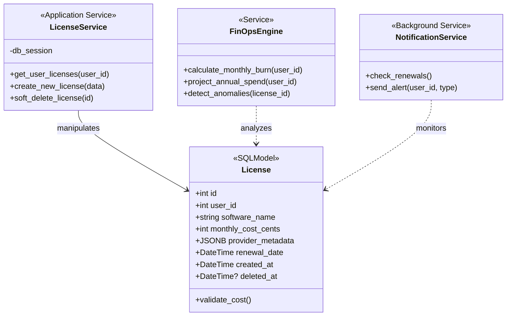

# 🏗️ Diagrama de Clases: Optima

Este documento detalla la estructura de clases de **Optima**, diseñada bajo los principios de **Clean Architecture** y **Domain-Driven Design (DDD)**. La arquitectura se divide en capas para garantizar que la lógica financiera (Core) sea independiente de la base de datos y de la API.

## Tabla de contenidos
1. [Diagrama de Clases](#1-diagrama-de-clases)
2. [Descripción de las Capas](#2-descripción-de-las-capas)
   - [2.1 Capa de Dominio (Models & Logic)](#21-capa-de-dominio-models--logic)
   - [2.2 Capa de Aplicación (Services & Managers)](#22-capa-de-aplicación-services--managers)
   - [2.3 Capa de Validación (Schemas)](#23-capa-de-validación-schemas)
3. [Alineación con la Ambición del Proyecto](#3-alineación-con-la-ambición-del-proyecto)

## 1. Diagrama de Clases

## 2. Descripción de las Capas

### 2.1 Capa de Dominio (Models & Logic)
*   **License (SQLModel):** Entidad híbrida que define tanto la estructura de la base de datos como las reglas de validación de la API. Incluye lógica de **Soft Delete** y soporte nativo para **JSONB**.
*   **FinOpsEngine:** El "cerebro" del sistema. Clase de servicio dedicada exclusivamente a cálculos complejos (proyecciones, quemado mensual), operando sobre objetos de dominio puros.

### 2.2 Capa de Aplicación (Services)
*   **LicenseService:** Orquesta las operaciones de negocio. Al usar SQLModel, interactúa directamente con la sesión de la base de datos, eliminando la necesidad de una capa de repositorio intermedia.
*   **NotificationService:** Servicio de fondo que monitorea el estado de las licencias y gestiona el ciclo de vida de las alertas.

### 2.3 Capa de Validación e Integridad
*   **SQLModel Validation:** Garantiza la **Precisión Financiera** mediante el uso de enteros (centavos). La validación ocurre en el momento de la instanciación, asegurando que ningún dato corrupto llegue al motor de cálculo.

## 3. Alineación con la Ambición del Proyecto

1.  **Agilidad:** La arquitectura simplificada permite iterar sobre las funcionalidades del MVP (Fase 3 y 4) con el mínimo de código repetitivo.
2.  **Resiliencia:** La validación integrada en los modelos previene la entrada de datos inconsistentes, cumpliendo con el KPI de **Precisión de Proyección**.
3.  **Auditabilidad:** El uso de un modelo único facilita el rastreo de cambios y la implementación de campos de auditoría (`created_at`, `updated_at`).

---

👉 *Para detalles sobre la implementación de la base de datos, ver:* [DATABASE.md](./DATABASE.md)

👉 *Para el flujo de datos completo, ver:* [ARCHITECTURE.md](./ARCHITECTURE.md)

---
*Última actualización: 13/02/2026*
