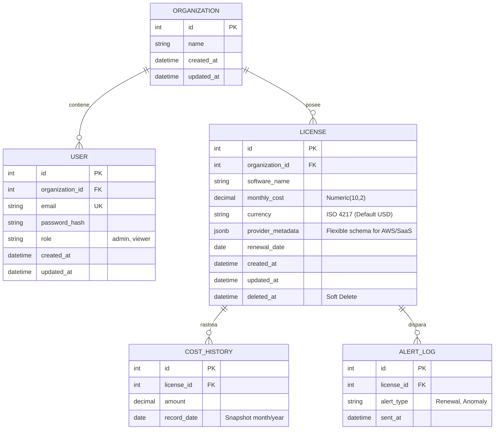

# 🗄️ Diseño de la Base de Datos: Optima

Este documento define la capa de persistencia de Optima. La base de datos está optimizada para la **integridad financiera**, el **análisis histórico** y la **flexibilidad de metadatos**.

## Tabla de contenidos
1. [Modelo Entidad-Relación (ERD)](#1-modelo-entidad-relación-erd)
2. [Especificaciones Técnicas de Campos](#2-especificaciones-técnicas-de-campos)
   - [2.1 Precisión Financiera](#21-precisión-financiera)
   - [2.2 Flexibilidad con `JSONB`](#22-flexibilidad-con-jsonb)
3. [Estrategia de Rendimiento (Índices)](#3-estrategia-de-rendimiento-índices)
4. [Integridad y Auditoría](#4-integridad-y-auditoría)

## 1. Modelo Entidad-Relación (ERD)

## 2. Especificaciones Técnicas de Campos

### 2.1 Precisión Financiera
*   **Tipo de Dato `Numeric(10,2)`:** Se prohíbe el uso de `Float` o `Real` para cualquier campo de costo. Esto garantiza que cálculos como la suma de miles de licencias no acumulen errores de redondeo binario.
*   **Moneda:** Aunque la v1.0 es en USD, el campo `currency` está normalizado para permitir una futura expansión multi-moneda sin cambios de esquema.

### 2.2 Flexibilidad con `JSONB`
El campo `provider_metadata` en la tabla `LICENSE` permite almacenar datos específicos de cada proveedor sin crear columnas vacías.
*   *Ejemplo AWS:* `{"instance_id": "i-123", "region": "us-east-1", "reservation_term": "1yr"}`
*   *Ejemplo SaaS:* `{"seats": 50, "plan": "Enterprise", "billing_id": "inv_990"}`

## 3. Estrategia de Rendimiento (Índices)

Para cumplir con el KPI de latencia **<200ms**, se implementan los siguientes índices:
1.  **B-Tree** en `license.organization_id`: Acelera la carga del dashboard por organización.
2.  **B-Tree** en `license.renewal_date`: Optimiza el motor de alertas.
3.  **GIN Index** en `license.provider_metadata`: Permite búsquedas rápidas dentro de los objetos JSON.
4.  **Partial Index** en `license.deleted_at IS NULL`: Asegura que las consultas de licencias activas no escaneen registros borrados.

## 4. Integridad y Auditoría

*   **Soft Deletes:** Ningún registro financiero se elimina físicamente. La columna `deleted_at` actúa como filtro global.
*   **Cost Tracking:** Cada cambio en el costo de una licencia debe generar una entrada en `COST_HISTORY` para permitir gráficos de tendencia (Month-over-Month).

---
👉 *Para ver cómo se mapean estos modelos en Python, consulta:* [CLASS_DIAGRAM.md](./CLASS_DIAGRAM.md)
