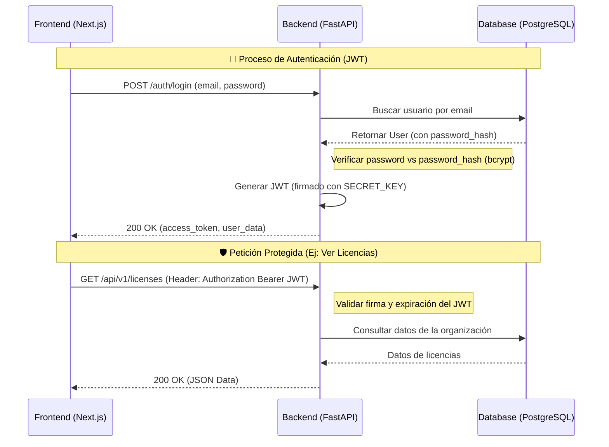

# 🔐 API Contract: Authentication

Este documento define el contrato entre el Frontend y el Backend para los servicios de autenticación de Optima.

## Base URL
`/api/v1/auth`

---

## Flujo de Trabajo (Request/Response Cycle)
El siguiente diagrama describe la interacción entre el Frontend y el Backend durante el proceso de autenticación y acceso a recursos protegidos.



---

## 1. Registro de Usuario y Organización
Crea una nueva organización y un usuario administrador vinculado a ella.

- **Endpoint:** `/register`
- **Método:** `POST`
- **Content-Type:** `application/json`

### Request Body
```json
{
  "email": "admin@empresa.com",
  "password": "password123",
  "organization_name": "Empresa S.A."
}
```

### Success Response (201 Created)
```json
{
  "access_token": "eyJhbGciOiJIUzI1NiIsInR5cCI6IkpXVCJ9...",
  "token_type": "bearer",
  "user": {
    "id": 1,
    "email": "admin@empresa.com",
    "organization_id": 1,
    "role": "admin",
    "created_at": "2026-03-12T10:00:00Z"
  },
  "organization": {
    "id": 1,
    "name": "Empresa S.A.",
    "created_at": "2026-03-12T10:00:00Z"
  }
}
```

### Error Responses
- **400 Bad Request:** Email ya registrado.
- **422 Unprocessable Entity:** Datos inválidos (ej: password demasiado corto).

---

## 2. Inicio de Sesión
Autentica a un usuario existente y devuelve un token JWT.

- **Endpoint:** `/login`
- **Método:** `POST`
- **Content-Type:** `application/json`

### Request Body
```json
{
  "email": "user@empresa.com",
  "password": "password123"
}
```

### Success Response (200 OK)
```json
{
  "access_token": "eyJhbGciOiJIUzI1NiIsInR5cCI6IkpXVCJ9...",
  "token_type": "bearer",
  "user": {
    "id": 1,
    "email": "user@empresa.com",
    "organization_id": 1,
    "role": "admin",
    "created_at": "2026-03-12T10:00:00Z"
  },
  "organization": {
    "id": 1,
    "name": "Empresa S.A.",
    "created_at": "2026-03-12T10:00:00Z"
  }
}
```

### Error Responses
- **401 Unauthorized:** Credenciales inválidas.
- **422 Unprocessable Entity:** Formato de email inválido.

---

## Estructura de Error Estándar
```json
{
  "detail": "Descripción detallada del error"
}
```
