```mermaid
flowchart TD
    Start([Pantalla de bienvenida]) --> Login[Login]
    Login --> Register[Registro]
    Register --> Welcome[Bienvenida]
    Welcome --> Dashboard[Dashboard]
    Dashboard --> ChangeLang[Cambiar Idioma ES/EN]
    ChangeLang --> Dashboard
    
    style Start fill:#1D4ED8
    style Login fill:#6B7280
    style Register fill:#6B7280
    style Welcome fill:#6B7280
    style Dashboard fill:#1D4ED8
    style ChangeLang fill:#334155
```

```mermaid
flowchart TD
    Start([Dashboard]) --> View[Ver Licencias]
    View --> Add[Agregar Licencia]
    Add --> Modal[Modal Formulario]
    Modal --> Save[Guardar]
    Save --> Success[Licencia Agregada/Actualizada]
    Success --> View
    View --> Edit[Editar]
    Edit --> Modal
    View --> Delete[Eliminar]
    Delete --> Confirm[Confirmar]
    Confirm --> Success
    View --> Start
    
    style Start fill:#1D4ED8
    style View fill:#334155
    style Add fill:#334155
    style Edit fill:#334155
    style Modal fill:#334155
    style Save fill:#6B7280
    style Confirm fill:#6B7280
    style Delete fill:#B91C1C
    style Success fill:#15803D
```

```mermaid
flowchart TD
    Start([Dashboard]) --> Analytics[Análisis Financiero]
    Analytics --> Filters[Aplicar Filtros]
    Filters --> Charts[Ver Gráficos]
    Charts --> Projection[Proyección Anual]
    Projection --> Insight[Acción Sugerida]
    Insight --> Modal[Modal de Confirmación]
    Modal --> Execute[Ejecutar Acción]
    Execute --> Feedback[Feedback Success / Error]
    Feedback --> Analytics
    
    style Start fill:#1D4ED8
    style Analytics fill:#334155
    style Filters fill:#6B7280
    style Charts fill:#6B7280
    style Projection fill:#6B7280
    style Insight fill:#334155
    style Modal fill:#15803D
    style Execute fill:#15803D
    style Feedback fill:#1D4ED8
```

```mermaid
flowchart TD
    Start([Dashboard]) --> Check{¿Alertas?}
    Check -->|Sí| Alerts[Ver Alertas]
    Alerts -->|Gestionar| Manage[Ver Detalle]
    Manage -->|Alertas| Alerts
    Check -->|No| NoAlerts[Sin Alertas]
    NoAlerts --> Dashboard
    Manage --> Decision{Decisión}
    Decision -->|Renovar| Renew[Renovar]
    Decision -->|Cancelar| Cancel[Cancelar]
    Renew --> Success[Modal Confirmación]
    Cancel --> Success[Modal Confirmación]
    Success --> Feedback[Feedback Success / Error]
    Feedback --> Retry/Back[Aceptar / Reintentar]
    Retry/Back --> Manage
    Retry/Back --> Dashboard
    
    style Start fill:#1D4ED8
    style Dashboard fill:#1D4ED8
    style Check fill:#334155
    style Alerts fill:#334155
    style Manage fill:#334155
    style Decision fill:#334155
    style Renew fill:#15803D
    style Cancel fill:#B91C1C
    style Success fill:#334155
    style Feedback fill:#1D4ED8
    style Retry/Back fill:#334155
    style NoAlerts fill:#6B7280
    
```

# User flows: Optima

Este documento describe los flujos de usuario críticos de la plataforma, facilitando la comprensión de la lógica de navegación y las reglas de negocio.

## Tabla de contenidos
1. [Navegación General](#1-navegación-general)
2. [Onboarding y acceso](#2-onboarding-y-acceso)
3. [Gestión de Licencias (Ciclo CRUD)](#3-gestión-de-licencias-ciclo-crud)
4. [Análisis Financiero (CFO Flow)](#4-análisis-financiero-cfo-flow)
5. [Alertas de Renovación](#5-alertas-de-renovación)
6. [Estado Transversal en Todos los Flujos](#6-estado-transversal-en-todos-los-flujos)

## 1. Flujo de Navegación General

```mermaid
graph TB
    Start[Pantalla de bienvenida] --> Login[Login]
    Login[Login] --> Dashboard[Dashboard]
    Register[Registro] --> Dashboard
    Dashboard --> Licenses[Licencias]
    Dashboard --> Analytics[Análisis]
    Dashboard --> Profile[Perfil]
    Licenses --> Dashboard
    Analytics --> Dashboard
    Profile --> Dashboard
    
    style Login fill:#6B7280
    style Register fill:#6B7280
    style Dashboard fill:#1D4ED8
    style Licenses fill:#334155
    style Analytics fill:#334155
```

---

## 2. Onboarding y acceso

### Flujo de Usuario

### Tipo de Usuario Principal
*   **Arquetipo:** Usuario General (IT Manager / CFO).
*   **Nivel de flujo:** Primario. Es la "puerta de entrada" y el momento crítico para retener al usuario.

### Objetivo de negocio del flujo
*   **Problema específico:** Reduce la fricción inicial y establece la configuración base (idioma/tema) para minimizar el abandono (Churn).
*   **Contribución a KPIs:** Impacta directamente en el **Time-to-Value**, permitiendo que el usuario llegue al dashboard configurado en el menor tiempo posible.

### Decisiones de diseño
*   **Orden de navegación:** `Login → Registro → Bienvenida → Dashboard (con botón ES/EN en header)`.
*   **Selector de Idioma:** Botón ES/EN ubicado en el header de la aplicación, visible después del login. El cambio es instantáneo y se persiste en `localStorage` del navegador.
*   **Jerarquía de información:** El selector de idioma está siempre accesible en el header para permitir cambios en cualquier momento, sin necesidad de acceder a configuración.
*   **Uso de feedback:** Toasts informativos si el usuario intenta registrar un correo ya existente, sugiriendo el acceso en lugar de un error genérico.

### Reglas de Negocio Implicadas
*   **Validaciones:** Verificación de formato de email y fortaleza de contraseña.
*   **Restricciones:** Un usuario no puede saltar al dashboard sin haber completado los términos de servicio básicos.
*   **Persistencia de Idioma:** La preferencia de idioma se guarda en `localStorage` con clave `optima-locale`. Si no existe, se detecta el idioma del navegador (`navigator.language`) o se usa `'es'` como predeterminado.

### Estados del Sistema y Casos de Error

**Estados principales:**
*   **Loading:** Pantalla de transición animada mientras se genera el token de sesión.
*   **Active State:** Mensaje de que los campos han sido ingresados correctamente.
*   **Idioma Cambiado:** El cambio de idioma es instantáneo sin recarga de página. Se muestra un toast sutil confirmando el cambio.

**Casos de error:**
*   **Error State (Login):** Mensajes claros de "Credenciales inválidas" o "Cuenta bloqueada". El usuario puede reintentar o ir a registro.
*   **Offline:** Deshabilitación de botones con aviso de conexión interrumpida. Los formularios se deshabilitan hasta restaurar conexión.
*   **Inline Validation (Register):** Mensajes de error en tiempo real junto a los campos del formulario (email inválido, contraseña débil).
*   **Email Existente:** Toast informativo sugiriendo ir a Login en lugar de mostrar error genérico.
*   **Session Expired State:** Mensaje de que la sesión ha expirado, redirigiendo a Login.

### Impacto técnico en desarrollo
*   **Rutas Protegidas:** Uso de middleware para redirigir a `/login` si no hay sesión.
*   **Manejo de estado:** Uso de **Context API** para el estado de autenticación (Auth State) y el estado de idioma (i18n State).
*   **LocalStorage:** Hook personalizado `useLocale()` que lee/escribe `localStorage` y sincroniza con el Context.

---

## 3. Gestión de Licencias (Ciclo CRUD)

### Flujo de Usuario

### Tipo de Usuario Principal
*   **Arquetipo:** **IT Manager**.
*   **Nivel de Flujo:** Primario. Es la actividad operativa central del perfil.

### Objetivo de Negocio del Flujo
*   **Problema específico:** Elimina la opacidad en el gasto y el error humano (hojas de cálculo manuales), centralizando la verdad financiera.
*   **Contribución a KPIs:** Impacta en la **Precisión de Proyección** y facilita la **Identificación de Ahorro**.

### Decisiones de Diseño
*   **Orden de navegación:** `Dashboard → Botón Agregar Licencia → Modal de Registro de Licencia → Confirmación → Dashboard`.
*   **Jerarquía de información:** Prioridad en campos financieros (Costo/Periodicidad) y temporales (Renovación).
*   **Uso de Modales:** Mantiene el contexto visual del dashboard mientras se opera.

### Reglas de Negocio Implicadas
*   **Validaciones:** Uso de `Decimal (Float)` para precisión monetaria total.
*   **Restricciones:** No permite fechas de renovación pasadas para licencias activas.

### Estados del Sistema y Casos de Error

**Estados principales:**
*   **Loading:** Skeleton loaders en campos de formulario durante la carga inicial.
*   **Empty State:** Pantalla ilustrada con CTA central: "Agrega tu primera licencia" cuando no hay licencias.
*   **Completed State:** Toast de confirmación: "Licencia agregada con éxito" / "Licencia editada correctamente".

**Casos de error:**
*   **Inline Validation:** Errores en tiempo real en campos del formulario (costo inválido, fecha incorrecta).
*   **Offline:** Deshabilitación de botones con aviso de conexión interrumpida. Los datos se guardan localmente y se sincronizan al restaurar conexión.
*   **Error al Guardar:** Toast de error con mensaje específico y opción de reintentar.
*   **Delete Confirmation:** Modal de confirmación antes de eliminar con opción de cancelar.

### Impacto Técnico en Desarrollo
*   **Optimistic Updates:** La licencia aparece en la lista instantáneamente (Tanstack Query) antes de confirmar con el backend.
*   **Sincronización:** Revalidación automática del gasto total (MTD Spend) tras el guardado.
*   **Formularios:** Validación en tiempo real con feedback visual inmediato.

---

## 4. Análisis Financiero (CFO Flow)

### Flujo de Usuario

### Tipo de Usuario Principal
*   **Arquetipo:** **CFO**.
*   **Nivel de Flujo:** Primario estratégico.

### Objetivo de Negocio del Flujo
*   **Problema específico:** Resuelve la falta de previsión y la incertidumbre sobre el flujo de caja futuro.
*   **Contribución a KPIs:** Eje de la **Precisión de Proyección (<1% varianza)**.

### Decisiones de Diseño
*   **Orden de navegación:** `Dashboard → Análisis Financiero → Filtro por Categoría → Vista Detallada → Proyección → Gráficos Recharts y Tabla de Datos → Acción sugerida → Modal de Confirmación → Ejecutar Acción → Feedback (Success / Error) → Análisis Financiero → Dashboard`.
*   **Jerarquía de información:** Prioridad en líneas de tendencia sobre tablas de datos.
*   **Filtros vs Tabs:** Se usan filtros laterales para comparar categorías sin perder el foco.

### Reglas de Negocio Implicadas
*   **Lógica de Datos:** Integridad de **Soft Delete**; se incluyen datos históricos en proyecciones aunque la licencia esté cancelada hoy.

### Estados del Sistema y Casos de Error

**Estados principales:**
*   **Loading:** Skeletons estructurales para evitar el "Layout Shift" en gráficos durante la carga.
*   **Completed State:** Toast de confirmación: "Proyecciones generadas con éxito".

**Casos de error:**
*   **Empty State:** Ilustración de "Datos Insuficientes" si la cuenta es muy nueva para generar tendencias. Mensaje motivador con sugerencia de agregar más licencias.
*   **Error State (Data Fetch Failure):** Mensaje de error claro con opción de reintentar la carga de datos.
*   **No Permissions State:** Mensaje informativo si el usuario no tiene permisos para acceder a esta sección.
*   **Insufficient Historical Data State:** Mensaje explicativo cuando no hay suficientes datos históricos para generar proyecciones confiables.

### Impacto Técnico en Desarrollo
*   **Local State:** **Zustand** para recordar la configuración de filtros del usuario entre sesiones.
*   **Rendimiento:** Datasets procesados se mantienen en memoria para filtrado inmediato sin recargar desde el backend.
*   **Gráficos:** Lazy loading de componentes Recharts para optimizar el tiempo de carga inicial.

---

## 5. Alertas de Renovación

### Flujo de Usuario

### Tipo de Usuario Principal
*   **Arquetipo:** **IT Manager**.
*   **Nivel de Flujo:** Secundario recurrente (estrictamente crítico por tiempo).

### Objetivo de Negocio del Flujo
*   **Problema específico:** Evita renovaciones automáticas no planificadas y pérdida de servicios críticos.
*   **Contribución a KPIs:** Impacta en la **Visibilidad de Renovación** (100% de alertas auditadas).

### Decisiones de Diseño
*   **Orden de navegación:** `Dashboard → Alertas de Renovación → Ver Alertas → Acción → Renovar/Cancelar → Feedback (Success / Error) → Dashboard`.
*   **Feedback Visual:** Uso de colores de alta visibilidad (`Destructive`) e íconos de advertencia ⚠️ (Doble codificación por A11Y).
*   **Punto de entrada:** Sección de "Prioridad" en el Dashboard que solo aparece si hay vencimientos < 7 días.

### Reglas de Negocio Implicadas
*   **Validación temporal:** Alerta detonada por `fecha_renovación - hoy <= 7 días`.
*   **Auditoría:** Marcar una alerta como "Gestionada" requiere una acción explícita (Renovar/Cancelar).

### Estados del Sistema y Casos de Error

**Estados principales:**
*   **Empty State:** Mensaje motivador: "Todo está bajo control. No hay renovaciones próximas".
*   **Alert State:** Badge de alerta visible con contador de licencias próximas a vencer.
*   **Clear State:** Toast de confirmación: "Licencias gestionadas con éxito".

**Casos de error:**
*   **Snoozed State:** Opción de posponer alerta con selección de tiempo (1 día, 3 días, 1 semana). Toast de confirmación.
*   **Escalation State:** Opción de escalar alerta a otro usuario con selección de destinatario. Toast de confirmación.
*   **Bulk Management State:** Selección múltiple de licencias para gestión masiva. Confirmación antes de procesar múltiples acciones.

### Escalabilidad
*   **Enterprise:** El sistema escala permitiendo agrupar alertas por "Importancia" o "Prioridad Técnica" cuando hay múltiples vencimientos simultáneos.

### Impacto Técnico en Desarrollo
*   **Notificaciones:** Sistema de alertas en tiempo real que se actualiza automáticamente cuando se acerca la fecha de renovación.
*   **Persistencia:** Las acciones sobre alertas se registran en el backend para auditoría (ADR-003, modelo AlertLog).

---

## 6. Estado Transversal en Todos los Flujos

**Authorization State (Role-Based UI):** El sistema muestra u oculta elementos de la interfaz según el rol del usuario (Admin, Viewer, etc.). Esto se aplica a todos los flujos documentados anteriormente.